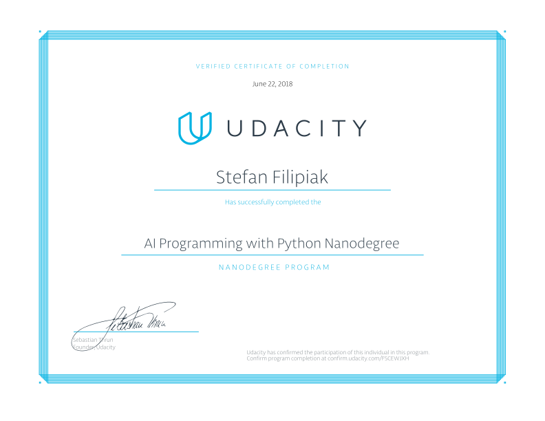

# AI Programming with Python Project

Project [code](https://github.com/udacity/aipnd-project) for Udacity's AI Programming with Python Nanodegree program. In this project, students first [develop](Image%20Classifier%20Project.ipynb) code for an image classifier built with PyTorch, then convert it into a command line application. The command line application consists of two parts. In the first part is an application to [train](train.py) the AI and the second part is used to [predict](predict.py) an image based on the trained network. 

You can have a look at the curriculum [here](https://udacity.com/course/ai-programming-python-nanodegree--nd089).

